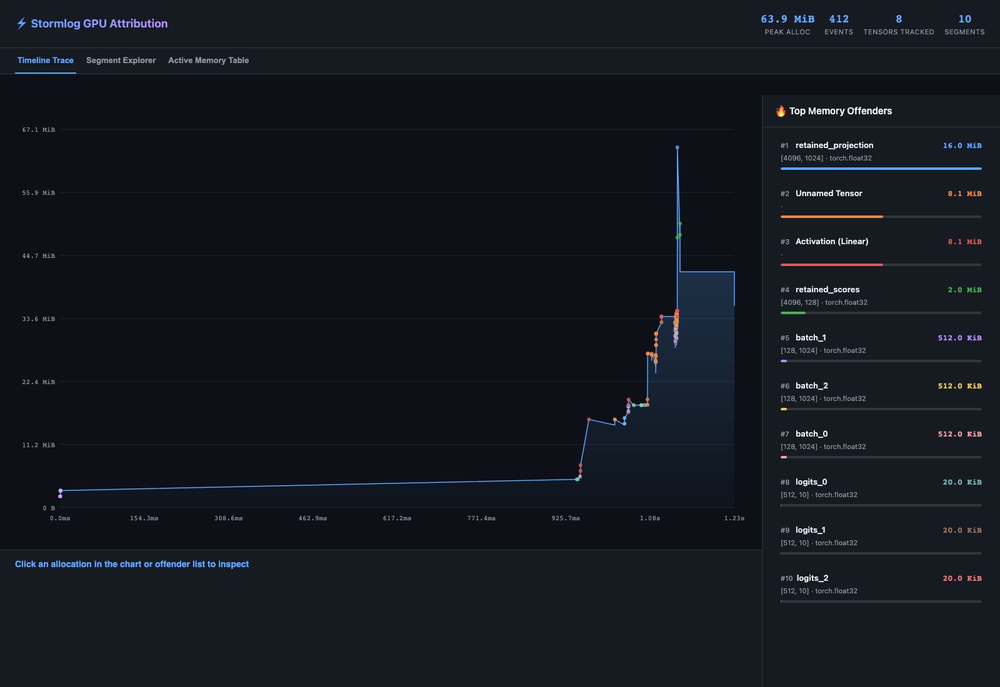
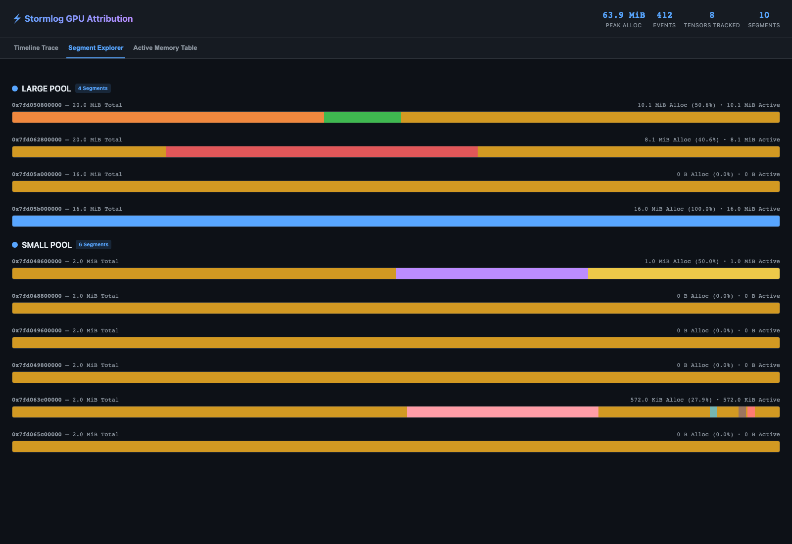
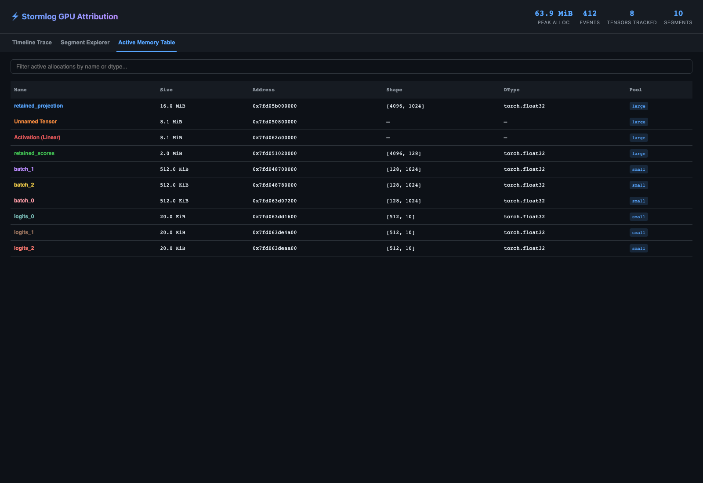

[← Back to Production Cookbook](index.md)

# PyTorch Production Recipes

Use these recipes when the workload is owned by PyTorch and you need a fast path
from a memory incident to a saved artifact and an actionable next step.

Audience: ML engineers, incident responders.
Difficulty: intermediate.

## Prerequisites

- install the package first with [Installation](../installation.md)
- use `pip install "stormlog[torch]"` for the PyTorch CLI and tracker paths
- on a fresh GPU host, check the framework build before using GPU recipes:
  `python -c "import torch; print(torch.__version__, torch.version.cuda, torch.cuda.is_available())"`
- use `pip install "stormlog[tui,torch]"` if you want the TUI diagnostics flow
- use a PyTorch runtime when you need `GPUMemoryProfiler` or CUDA-specific OOM evidence
- use the [Usage Guide](../usage.md) if you need API-level reference instead of CLI-first triage

Success signal:

- the first workload-backed recipe records non-zero GPU memory
- you leave the incident with at least one saved artifact or report
- the chosen workflow ends in a concrete next step, not just console output

## Choose the first PyTorch recipe

| If the main goal is... | Start with... |
| --- | --- |
| check a small in-process workload first | profile a single GPU step |
| capture a short, shareable timeline | bounded `track` |
| save a portable diagnostic bundle fast | `diagnose --duration 0` |
| capture CUDA allocator-history evidence | `diagnose --native-history` |
| rehearse the OOM flow safely in a checkout | `examples.scenarios.oom_flight_recorder_scenario` |

## Recipe: profile a single GPU step

```python
import torch
from stormlog import GPUMemoryProfiler

profiler = GPUMemoryProfiler(track_tensors=True)
device = profiler.device
model = torch.nn.Linear(1024, 256).to(device)

def train_step() -> torch.Tensor:
    x = torch.randn(64, 1024, device=device)
    y = model(x)
    return y.sum()

profile = profiler.profile_function(train_step)
summary = profiler.get_summary()

print(profile.function_name)
print(f"Peak memory: {summary['peak_memory_usage'] / (1024**2):.2f} MB")
```

Use this when you want a small in-process CUDA workload before moving to CLI
artifact flows.

If `torch.cuda.is_available()` is `False` on a GPU host, fix the PyTorch build
before continuing. The [Installation Guide](../installation.md) and
[GPU Setup Guide](../gpu_setup.md) are the right references there.

## Recipe: capture a bounded CLI artifact window

```bash
gpumemprof track \
  --duration 30 \
  --interval 0.5 \
  --output ./track.json \
  --format json
```

Use this when you want a short capture that you can archive, share, or analyze
without keeping a sink directory around.

Treat this as an artifact-flow command after the runtime is already known-good.
On an otherwise idle CLI process it can record little or no meaningful GPU
activity by itself.

## Recipe: export a diagnose bundle

```bash
gpumemprof diagnose --duration 0 --output ./diag_bundle
```

Use `--duration 0` when you want the bundle structure and current runtime
context quickly, not a new long sampling window.

## Recipe: capture CUDA-native OOM evidence

```bash
gpumemprof diagnose --native-history --duration 0 --output ./diag_bundle_native
```

This is the CUDA-only path for allocator-history artifacts such as native
snapshots and state-history files.

Do not use this path on CPU-only or non-CUDA hosts. Fall back to the standard
diagnose bundle there.

## Recipe: generate the annotated allocator-history HTML

```bash
python -m examples.basic.cuda_native_history_demo --output ./diag_bundle_native_demo
```

This is source-checkout only. Use it when you want a workload-backed artifact
that reliably populates the Stormlog-native annotated HTML instead of capturing
an otherwise idle CLI process.

The command writes the standard native-history files plus
`cuda_allocator_state_history_annotated.html`, which combines the timeline
trace, segment explorer, and active-memory table in one self-contained file.

### What the annotated HTML shows

Generated from `examples.basic.cuda_native_history_demo` on an L4 host:



The timeline trace lets you inspect cumulative allocator growth and click into a
specific attributed allocation.



The segment explorer shows how each CUDA segment is partitioned between active
allocations and inactive/fragmented blocks.



The active-memory table is the fastest way to confirm which named tensors or
retained activations were still live at snapshot time.

## Recipe: turn saved telemetry into a report

```bash
gpumemprof analyze ./track.json --format txt --output ./analysis.txt
```

Use `--visualization --plot-dir ./plots` when you also want saved plots.

## Recipe: rehearse the OOM workflow safely from a source checkout

```bash
python -m examples.scenarios.oom_flight_recorder_scenario --mode simulated
```

This is source-checkout only. Pip installs do not include `examples/`.

## What to look for in the report

- `critical_issues`
- `high_impact_insights`
- `recommendations`
- `optimization_score`
- `gap_analysis` when telemetry events are available
- `collective_attribution` when hidden-memory spikes align with communication signals

## What to do next

- If `critical_issues` or high-priority recommendations point to growth over
  time, move to the [Incident Playbooks](incidents.md) leak and growth path.
- If `gap_analysis` is populated, move to the hidden-memory-gap checklist in
  [Incident Playbooks](incidents.md).
- If `collective_attribution` is populated and the workload is multi-rank, move
  to the [Distributed Diagnostics Recipes](distributed.md).
- If the main need is a long-running operational deployment, move to
  [Always-on Tracking](always_on.md).

## Troubleshooting

### Symptom: `diagnose --native-history` fails immediately

Likely cause: the runtime is not CUDA-backed.
Fix: use the standard diagnose bundle instead.
Verify: the regular diagnose command completes and writes a manifest.

### Symptom: `torch.cuda.is_available()` is `False` on a GPU host

Likely cause: the installed PyTorch wheel does not match the host driver/runtime.
Fix: install a PyTorch build that matches the current CUDA stack, then rerun the
minimal `GPUMemoryProfiler` snippet above.
Verify: the version check in prerequisites prints `True` for
`torch.cuda.is_available()`.

### Symptom: the report suggests hidden memory but not a leak

Likely cause: the peak is not fully explained by allocated-memory telemetry.
Fix: inspect `gap_analysis` and `collective_attribution` before changing allocator settings.
Verify: the next step comes from the hidden-memory-gap path, not generic leak tuning.

---

[← Back to Production Cookbook](index.md)
